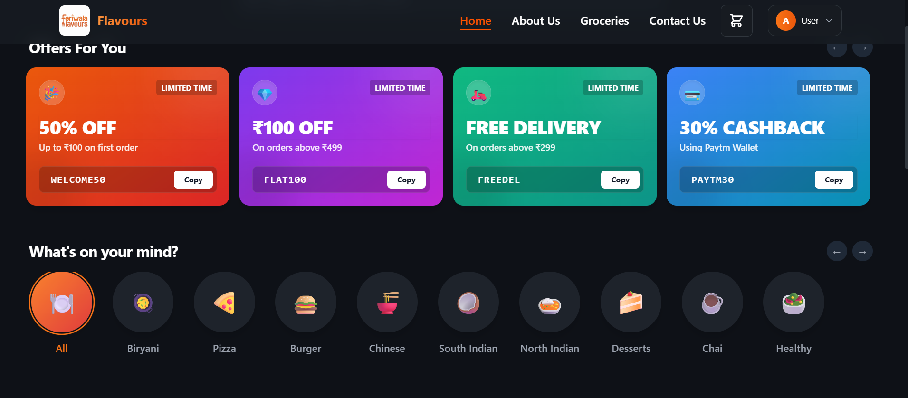
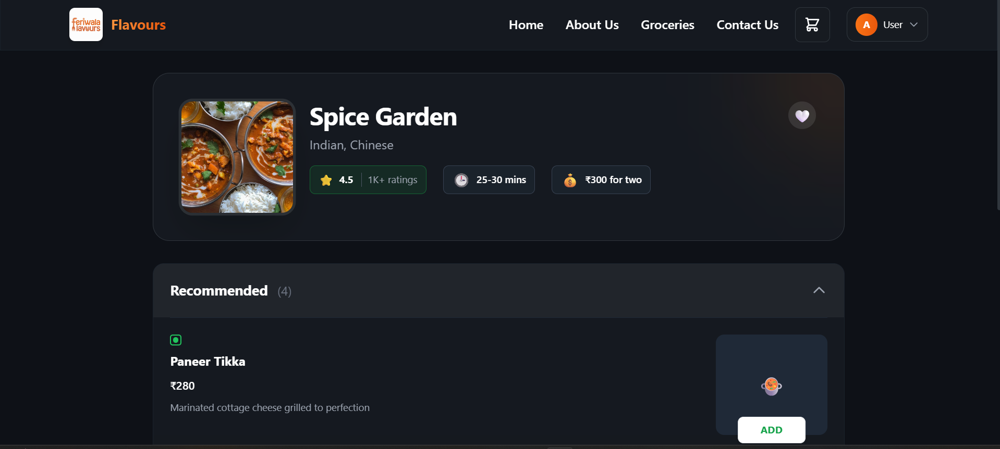
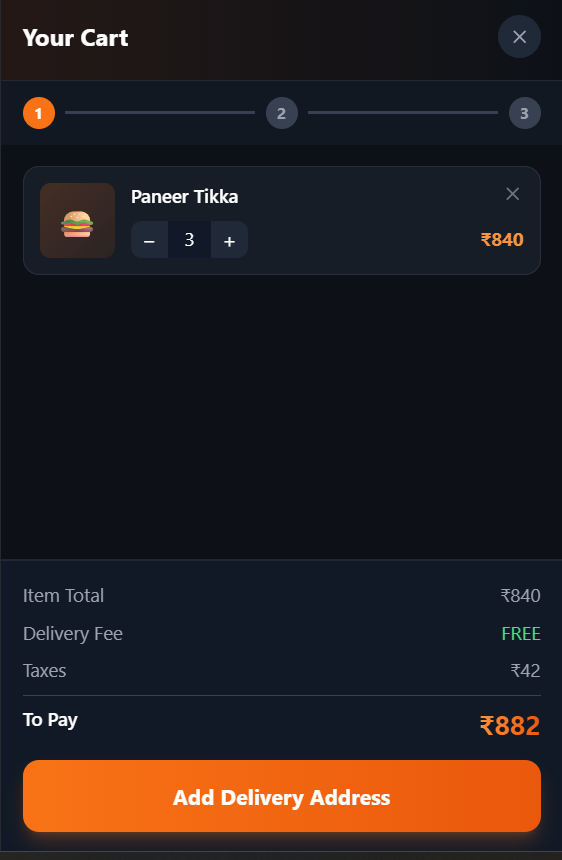
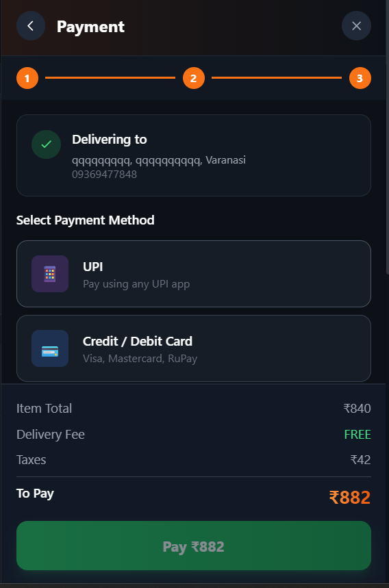

<div align="center">
  
  <h1>Flavours - Modern Food Ordering App</h1>
  <p>
    <strong>A premium, full-stack food delivery application built with the MERN stack.</strong>
  </p>
  <p>
    <a href="#features">Features</a> •
    <a href="#tech-stack">Tech Stack</a> •
    <a href="#getting-started">Getting Started</a> •
    <a href="#screenshots">Screenshots</a>
  </p>
</div>

<br />

## 📋 Overview

**Flavours** is a feature-rich "Micro SaaS" style food ordering platform designed for speed and aesthetics. It allows users to browse restaurants, manage favorites, customize orders, and track deliveries in real-time.

Built with a focus on **User Experience**, it features a glassmorphic UI, smooth animations, and a robust backend for managing orders and user data.

## ✨ Key Features

### 🛍️ Core Experience
- **Dynamic Cart System**: Real-time price calculation, tax estimation, and delivery fees.
- **Smart Search**: Filter restaurants by cuisine, rating, or delivery time.
- **Favorites Manager**: Save your top restaurants and dishes for quick access.
- **Address Book**: Save 'Home', 'Work', and 'Other' addresses for one-tap checkout.

### 🔐 Authentication & Profile
- **Secure Auth**: JWT-based login/signup with session persistence (365 days).
- **User Profile**: Track order history, view stats, and manage saved data.
- **Guest Restrictions**: intelligent prompts to login before checkout.

### 💳 Checkout & Global State
- **Seamless Checkout**: 3-step process (Cart -> Address -> Payment).
- **Order History**: View past orders and "Reorder" with a single click.
- **Global Context**: Centralized state management for Cart, Auth, and Favorites.

## 🛠️ Tech Stack

**Frontend**
- **React.js 19**: Latest features with Functional Components & Hooks.
- **TailwindCSS**: Utility-first styling for a custom, responsive design.
- **Context API**: For global state management (Redux-free architecture).
- **Parcel**: Blazing fast bundler.

**Backend**
- **Node.js & Express**: RESTful API architecture.
- **MongoDB**: NoSQL database for flexible data storage.
- **Mongoose**: ODM for strict schema validation.
- **JWT**: Secure token-based authentication.

## 📸 Screenshots

| Landing Page | Restaurant UI |
|:---:|:---:|
|  |  |

| Smart Cart | Secure Payment |
|:---:|:---:|
|  |  |

## 🚀 Getting Started

### Prerequisites
- Node.js (v16+)
- MongoDB (Local or Atlas URI)

### Installation

1. **Clone the repository**
   ```bash
   git clone https://github.com/bluecoder1080/Flavours.git
   cd Flavours
   ```

2. **Install Dependencies**
   ```bash
   npm install
   ```

3. **Configure Environment**
   Create a `.env` file in the root directory:
   ```env
   MONGODB_URI=your_mongodb_connection_string
   JWT_SECRET=your_super_secret_key
   PORT=5002
   ```

4. **Run the App**
   Start both frontend and backend concurrently:
   ```bash
   npm run dev
   ```
   
   - Frontend: `http://localhost:1234`
   - Backend: `http://localhost:5002`

## 👨‍💻 Author

**Aditya Singh**
- GitHub: [@bluecoder1080](https://github.com/bluecoder1080)

---

<div align="center">
  <sub>Built with ❤️ for foodies everywhere.</sub>
</div>
