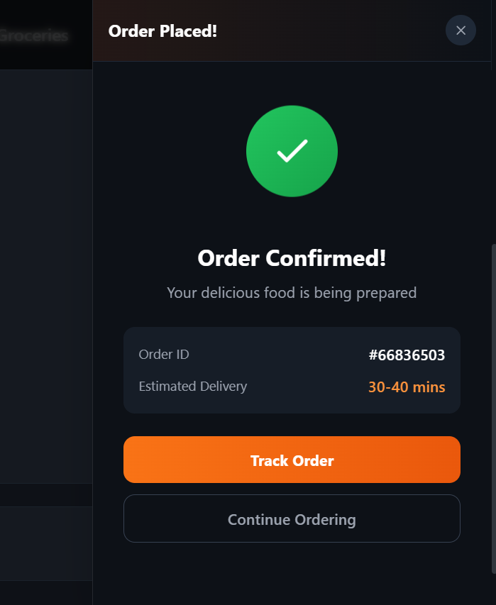
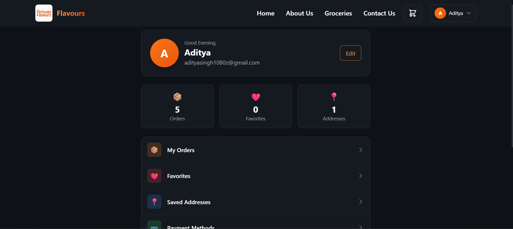

<div align="center">
  
  
  # 🍽️ Flavours
  
  ### A Modern Food Ordering Experience
  
  [](https://flavours-ten.vercel.app/)
  [](https://flavours-apii.onrender.com)
  [](https://react.dev)
  [](https://nodejs.org)
  [](https://mongodb.com)

  <p>
    <a href="#-features">Features</a> •
    <a href="#-screenshots">Screenshots</a> •
    <a href="#-tech-stack">Tech Stack</a> •
    <a href="#-getting-started">Get Started</a> •
    <a href="#-live-demo">Live Demo</a>
  </p>
</div>

---

## 🎯 Overview

**Flavours** is a premium, full-stack food delivery platform designed with modern aesthetics and seamless user experience. Built with the MERN stack, it features a stunning glassmorphic UI, smooth animations, and a robust backend for real-time order management.

<div align="center">
  
  <p><em>🏠 Beautiful Landing Page with Restaurant Discovery</em></p>
</div>

---

## ✨ Features

### 🏪 Restaurant Discovery
Browse through curated restaurants with beautiful cards, ratings, and delivery time estimates.

<div align="center">
  
  <p><em>🍕 Explore Restaurant Menus with Dynamic Dish Cards</em></p>
</div>

---

### 🛒 Smart Cart System
Real-time price calculation with tax estimation, delivery fees, and seamless quantity updates.

<div align="center">
  
  <p><em>🛍️ Dynamic Cart with Live Total Calculation</em></p>
</div>

---

### 💳 Secure Checkout
3-step checkout process: Cart → Address → Payment with multiple payment options.

<div align="center">
  
  <p><em>💳 Multiple Payment Methods: UPI, Cards, COD</em></p>
</div>

---

### ✅ Order Confirmation
Beautiful order success screen with order ID and estimated delivery time.

<div align="center">
  
  <p><em>🎉 Order Placed Successfully!</em></p>
</div>

---

### 👤 User Profile
Complete profile management with order history, favorites, and saved addresses.

<div align="center">
  
  <p><em>👤 User Dashboard with Stats & Quick Actions</em></p>
</div>

---

## 🛠️ Tech Stack

<table>
  <tr>
    <td align="center" width="50%">
      <h3>Frontend</h3>
      <br/>
      <b>React 19</b> • <b>TailwindCSS</b> • <b>Context API</b><br/>
      Parcel Bundler • React Router
    </td>
    <td align="center" width="50%">
      <h3>Backend</h3>
      <br/>
      <b>Node.js</b> • <b>Express</b> • <b>MongoDB</b><br/>
      Mongoose ODM • JWT Auth
    </td>
  </tr>
</table>

---

## 🌐 Live Demo

| Service | URL | Status |
|---------|-----|--------|
| 🖥️ **Frontend** | [flavours-ten.vercel.app](https://flavours-ten.vercel.app/) | [](https://flavours-ten.vercel.app/) |
| 🔗 **Backend API** | [flavours-apii.onrender.com](https://flavours-apii.onrender.com) | [](https://flavours-apii.onrender.com) |

> ⚠️ **Note**: Backend is hosted on Render's free tier and may take 30-50 seconds to wake up after inactivity.

---

## 🚀 Getting Started

### Prerequisites
- Node.js v16+
- MongoDB Atlas account (or local MongoDB)

### Installation

```bash
# Clone the repository
git clone https://github.com/bluecoder1080/Flavours.git
cd Flavours

# Install dependencies
npm install

# Configure environment
# Create a .env file in root:
MONGODB_URI=your_mongodb_connection_string
JWT_SECRET=your_super_secret_key
SERVER_PORT=5002

# Run development server (frontend + backend)
npm run dev
```

**Local URLs:**
- Frontend: `http://localhost:1234`
- Backend: `http://localhost:5002`

---

## 📁 Project Structure

```
Flavours/
├── src/                    # React Frontend
│   ├── Components/         # UI Components
│   ├── context/            # Global State (Auth, Cart, Orders)
│   └── config.js           # API Configuration
├── backend/                # Express Backend
│   ├── models/             # MongoDB Schemas
│   ├── routes/             # API Endpoints
│   └── middleware/         # Auth Middleware
└── assets/                 # Screenshots & Media
```

---

## 🔑 Key Features

| Feature | Description |
|---------|-------------|
| 🔐 **JWT Auth** | Secure token-based authentication with 365-day sessions |
| 🛒 **Smart Cart** | Auto-calculate totals, taxes, and delivery fees |
| 📍 **Address Book** | Save multiple addresses (Home, Work, Other) |
| ❤️ **Favorites** | Quick access to your favorite restaurants |
| 📦 **Order History** | Track all past orders with reorder functionality |
| 🎨 **Glassmorphism UI** | Modern, premium design with smooth animations |

---

## 👨‍💻 Author

<div align="center">
  
  <h3>Aditya Singh</h3>
  
  [](https://github.com/bluecoder1080)
</div>

---

<div align="center">
  <sub>Built with ❤️ and lots of ☕ for foodies everywhere</sub>
  <br/><br/>
  ⭐ Star this repo if you found it helpful!
</div>
